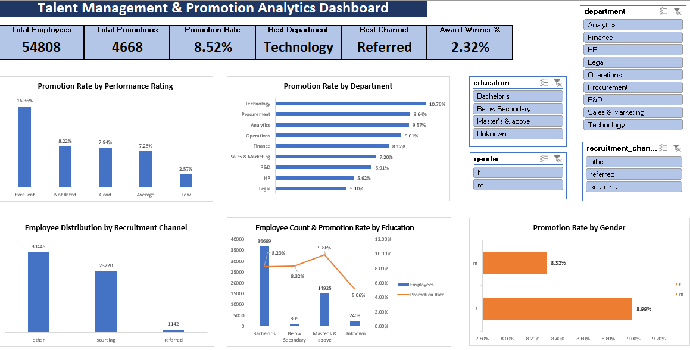

# Talent Management & Promotion Analytics Dashboard

## Overview

This project analyzes employee promotion patterns and workforce performance using Microsoft Excel. The objective was to identify key factors influencing promotions and build an interactive dashboard that enables HR teams and management to explore promotion trends across departments, education levels, recruitment channels, performance ratings, and gender.

The dashboard was built using Excel Pivot Tables, Pivot Charts, KPI Cards, Slicers, and helper calculations to provide actionable workforce insights.

---

## Dashboard Preview

---

## Business Questions

This analysis was conducted to answer the following questions:

* Which departments have the highest promotion rates?
* How does employee performance impact promotion outcomes?
* Which recruitment channel produces the highest promotion success?
* Does education level influence promotion probability?
* Are there significant differences in promotion rates across genders?
* What workforce segments demonstrate the strongest promotion performance?

---

## Key Findings

### Performance Rating Drives Promotions

Employees with an **Excellent** performance rating achieved a promotion rate of **16.36%**, significantly higher than all other rating categories.

### Technology Leads All Departments

The **Technology** department recorded the highest promotion rate (**10.76%**), while Legal and HR showed comparatively lower promotion rates.

### Employee Referrals Perform Best

Candidates hired through the **Referred** recruitment channel achieved the highest promotion rate (**12.08%**), outperforming sourcing and other channels.

### Higher Education Shows Positive Impact

Employees holding a **Master's Degree or Above** demonstrated stronger promotion outcomes compared to other education groups.

### Gender Promotion Rates Are Balanced

Promotion rates were relatively similar across genders, indicating limited disparity in promotion outcomes.

---

## Dashboard Features

### KPI Cards

* Total Employees
* Total Promotions
* Overall Promotion Rate
* Best Performing Department
* Best Recruitment Channel
* Award Winner Percentage

### Interactive Filters

* Gender
* Department
* Education
* Recruitment Channel

### Visual Analysis

* Promotion Rate by Performance Rating
* Promotion Rate by Department
* Employee Distribution by Recruitment Channel
* Employee Count & Promotion Rate by Education
* Promotion Rate by Gender

---

## Tools & Techniques Used

* Microsoft Excel
* Pivot Tables
* Pivot Charts
* Slicers
* KPI Cards
* Data Cleaning
* Helper Columns
* Dashboard Design
* Business Analysis

---

## Project Workflow

1. Cleaned and validated employee data.
2. Created helper columns for analytical segmentation.
3. Built KPI calculation layer.
4. Developed pivot tables for exploratory analysis.
5. Created interactive visualizations.
6. Connected slicers across dashboard components.
7. Designed a single-page executive dashboard.

---

## Files Included

* Talent_Management_Promotion_Analytics_Dashboard.xlsx
* dataset.csv
* dashboard_screenshot.png
* README.md

---

## Skills Demonstrated

* Data Cleaning & Preparation
* Exploratory Data Analysis
* KPI Development
* HR Analytics
* Dashboard Design
* Data Visualization
* Business Insight Generation
* Excel Reporting

---

### Author

Abhay Goral

